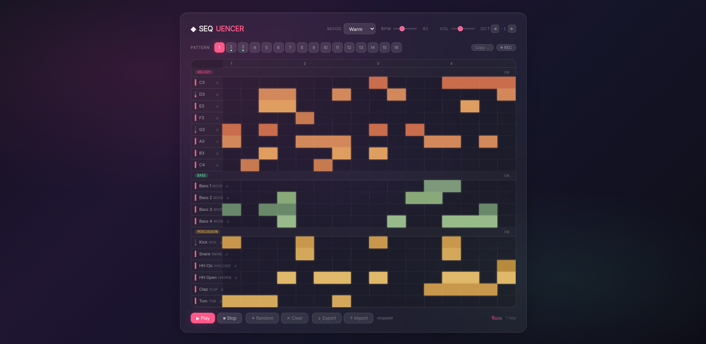

# ◆ Sequencer

Interactive browser-based step sequencer with melodic, bass, and percussion tracks. Compose patterns, switch between moods, and layer sounds in real time — zero dependencies, one HTML file.

## Features

- **18 tracks** — 8 melody (C3–C4), 4 bass, 6 percussion (kick, snare, hi-hat open/closed, clap, tom, rim, shaker, tambourine, crash, ride, cowbell, conga)
- **16 patterns** — switch between them while playing; each stores notes, mood, and octave independently
- **12 moods** — each changes scale (major, minor, pentatonic, blues, dorian, mixolydian, harmonic minor, whole tone), waveform (sine, sawtooth, triangle, square), filter cutoff, and color palette — Warm, Deep, Airy, Edge, Mellow, Bright, Dark, Dream, Cyber, Neon, Void, Nebula
- **Rec mode** — toggle Rec (R), switch patterns to assemble new parts while the original keeps looping, ghost notes show the playing pattern
- **Per-track volume** — drag the bar next to each track name
- **Per-track sound overrides** — right-click percussion to swap between 13 sounds; right-click bass to change waveform
- **Section mute** — toggle melody, bass, or percussion on/off with a single click
- **Octave shift** — shift all melody/bass notes ±3 octaves
- **Random fill** — generates a pattern with kick on quarters, snare on backbeats, and random fills
- **Copy / Export / Import** — copy patterns between slots, export full state to JSON, import from file
- **Auto-save** — all state persists in localStorage across sessions
- **Demo pattern** — loads automatically on first visit
- **Glassmorphism UI** — backdrop blur, dynamic gradients per mood, responsive layout
- **Full keyboard control** — all actions accessible via hotkeys
- **Web Audio API** — pure synthesis (sine, sawtooth, triangle, square) with per-note low-pass filter and soft-clipping

## Controls

| Key | Action |
|-----|--------|
| Space | Play / Pause |
| 1–9 | Select pattern |
| ↑ / ↓ | Octave up / down |
| R | Toggle Rec mode |
| S | Stop |
| C | Clear pattern |
| B / P / M | Toggle Bass / Percussion / Melody section |
| ? or / | Show hotkey help |
| Esc | Close help modal |

## Usage

1. Open `index.html` in any modern browser
2. Click cells to place notes, click again to remove
3. Press Space to start playback
4. Switch moods with the dropdown, adjust BPM and master volume
5. Right-click percussion / bass tracks to swap sounds
6. Press R for Rec mode — compose new patterns while playback continues

## File structure

```
index.html      — HTML structure
styles.css      — glassmorphism theme, mood backgrounds, grid, modal, context menu
script.js       — audio engine, UI, state management, serialization
image.png       — screenshot
PRD.md          — product requirements document
```

Built with vanilla JavaScript and the Web Audio API. No dependencies.